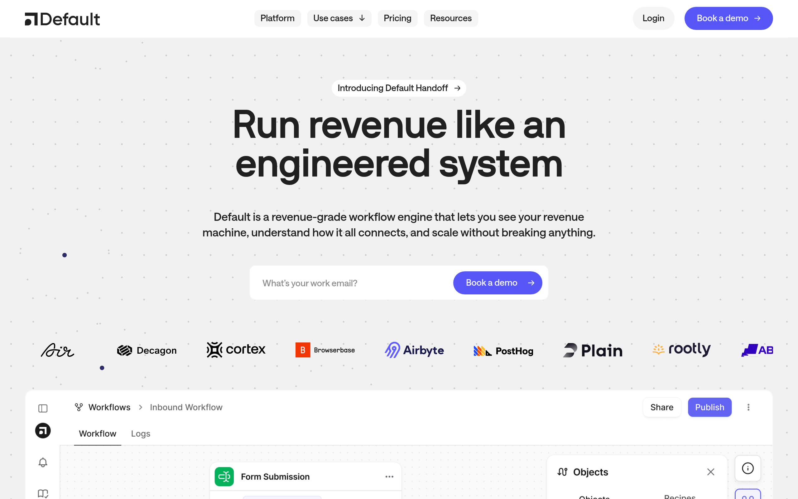

# default Design System

You are building UI for **default**. Light-themed, cool palette, sans-serif typography (NB International Pro), compact density on a 4px grid.

## Visual Reference

**IMPORTANT**: Study ALL screenshots below before writing any UI. Match colors, typography, spacing, layout, and motion exactly as shown.

### Homepage



> Read `references/DESIGN.md` for full token details.

## Design Philosophy

- **Layered depth** — use shadow tokens to create a sense of physical layering. Each elevation level has a specific shadow.
- **Gradient accents** — gradients are used thoughtfully for emphasis, not decoration.
- **Type pairing** — NB International Pro for body/UI text, webflow-icons for headings/display. Never introduce a third typeface.
- **compact density** — 4px base grid. Every dimension is a multiple of 4.
- **cool palette** — the color temperature runs cool, matching the sans-serif typography.
- **Restrained accent** — `#0082f3` is the only pop of color. Used exclusively for CTAs, links, focus rings, and active states.
- **Subtle motion** — transitions smooth state changes. Keep durations under 300ms, use ease-out curves.

## Color System

### Core Palette

| Role | Token | Hex | Use |
|------|-------|-----|-----|
| Background | `--background` | `#ffffff` | Page/app background |
| Text Primary | `--text-primary` | `#222222` | Headings, body text |
| Text Muted | `--text-muted` | `#758696` | Captions, placeholders |
| Accent | `--accent` | `#0082f3` | CTAs, links, focus rings |
| Border | `--border` | `#333333` | Dividers, card borders |

### Status Colors

| Status | Hex | Use |
|--------|-----|-----|
| Danger | `#ffdede` | Errors, destructive actions |

### Extended Palette

- **base-color-neutral--neutral-lightest\<deleted\|variable-eede0174-1898-a99e-0c79-395339ec1911\>:** `#eeeeee` — Light surface or highlight color
- **base-color-neutral--black\<deleted\|variable-419fddc9-288d-5141-33c5-0873c4ce2f53\>:** `#000000` — Deep background layer or shadow color
- **brand--purple:** `#5757f8` — Core brand color
- `#dddddd`
- `#3898ec`
- `#999999`
- `#c8c8c8`
- `#2d40ea`

### CSS Variable Tokens

```css
--brand--border: #f7f5fd;
--brand--border: #f7f5fd;
--brand--border: #f7f5fd;
--brand--border: #f7f5fd;
--brand--border: #f7f5fd;
```

## Typography

### Font Stack

- **NB International Pro** — Heading 1, Heading 2, Heading 3
- **webflow-icons** — Body, Caption

### Font Sources

```css
@font-face {
  font-family: "NB International Pro";
  src: url("fonts/NBInternationalPro-700.woff2") format("woff2");
  font-weight: 700;
}
@font-face {
  font-family: "Saans Trial";
  src: url("fonts/SaansTrial-300.ttf") format("truetype");
  font-weight: 300;
}
@font-face {
  font-family: "webflow-icons";
  src: url("data:application/x-font-ttf;charset=utf-8;base64,AAEAAAALAIAAAwAwT1MvMg8SBiUAAAC8AAAAYGNtYXDpP+a4AAABHAAAAFxnYXNwAAAAEAAAAXgAAAAIZ2x5ZmhS2XEAAAGAAAADHGhlYWQTFw3HAAAEnAAAADZoaGVhCXYFgQAABNQAAAAkaG10eCe4A1oAAAT4AAAAMGxvY2EDtALGAAAFKAAAABptYXhwABAAPgAABUQAAAAgbmFtZSoCsMsAAAVkAAABznBvc3QAAwAAAAAHNAAAACAAAwP4AZAABQAAApkCzAAAAI8CmQLMAAAB6wAzAQkAAAAAAAAAAAAAAAAAAAABEAAAAAAAAAAAAAAAAAAAAABAAADpAwPA/8AAQAPAAEAAAAABAAAAAAAAAAAAAAAgAAAAAAADAAAAAwAAABwAAQADAAAAHAADAAEAAAAcAAQAQAAAAAwACAACAAQAAQAg5gPpA//9//8AAAAAACDmAOkA//3//wAB/+MaBBcIAAMAAQAAAAAAAAAAAAAAAAABAAH//wAPAAEAAAAAAAAAAAACAAA3OQEAAAAAAQAAAAAAAAAAAAIAADc5AQAAAAABAAAAAAAAAAAAAgAANzkBAAAAAAEBIAAAAyADgAAFAAAJAQcJARcDIP5AQAGA/oBAAcABwED+gP6AQAABAOAAAALgA4AABQAAEwEXCQEH4AHAQP6AAYBAAcABwED+gP6AQAAAAwDAAOADQALAAA8AHwAvAAABISIGHQEUFjMhMjY9ATQmByEiBh0BFBYzITI2PQE0JgchIgYdARQWMyEyNj0BNCYDIP3ADRMTDQJADRMTDf3ADRMTDQJADRMTDf3ADRMTDQJADRMTAsATDSANExMNIA0TwBMNIA0TEw0gDRPAEw0gDRMTDSANEwAAAAABAJ0AtAOBApUABQAACQIHCQEDJP7r/upcAXEBcgKU/usBFVz+fAGEAAAAAAL//f+9BAMDwwAEAAkAABcBJwEXAwE3AQdpA5ps/GZsbAOabPxmbEMDmmz8ZmwDmvxmbAOabAAAAgAA/8AEAAPAAB0AOwAABSInLgEnJjU0Nz4BNzYzMTIXHgEXFhUUBw4BBwYjNTI3PgE3NjU0Jy4BJyYjMSIHDgEHBhUUFx4BFxYzAgBqXV6LKCgoKIteXWpqXV6LKCgoKIteXWpVSktvICEhIG9LSlVVSktvICEhIG9LSlVAKCiLXl1qal1eiygoKCiLXl1qal1eiygoZiEgb0tKVVVKS28gISEgb0tKVVVKS28gIQABAAABwAIAA8AAEgAAEzQ3PgE3NjMxFSIHDgEHBhUxIwAoKIteXWpVSktvICFmAcBqXV6LKChmISBvS0pVAAAAAgAA/8AFtgPAADIAOgAAARYXHgEXFhUUBw4BBwYHIxUhIicuAScmNTQ3PgE3NjMxOAExNDc+ATc2MzIXHgEXFhcVATMJATMVMzUEjD83NlAXFxYXTjU1PQL8kz01Nk8XFxcXTzY1PSIjd1BQWlJJSXInJw3+mdv+2/7c25MCUQYcHFg5OUA/ODlXHBwIAhcXTzY1PTw1Nk8XF1tQUHcjIhwcYUNDTgL+3QFt/pOTkwABAAAAAQAAmM7nP18PPPUACwQAAAAAANciZKUAAAAA1yJkpf/9/70FtgPDAAAACAACAAAAAAAAAAEAAAPA/8AAAAW3//3//QW2AAEAAAAAAAAAAAAAAAAAAAAMBAAAAAAAAAAAAAAAAgAAAAQAASAEAADgBAAAwAQAAJ0EAP/9BAAAAAQAAAAFtwAAAAAAAAAKABQAHgAyAEYAjACiAL4BFgE2AY4AAAABAAAADAA8AAMAAAAAAAIAAAAAAAAAAAAAAAAAAAAAAAAADgCuAAEAAAAAAAEADQAAAAEAAAAAAAIABwCWAAEAAAAAAAMADQBIAAEAAAAAAAQADQCrAAEAAAAAAAUACwAnAAEAAAAAAAYADQBvAAEAAAAAAAoAGgDSAAMAAQQJAAEAGgANAAMAAQQJAAIADgCdAAMAAQQJAAMAGgBVAAMAAQQJAAQAGgC4AAMAAQQJAAUAFgAyAAMAAQQJAAYAGgB8AAMAAQQJAAoANADsd2ViZmxvdy1pY29ucwB3AGUAYgBmAGwAbwB3AC0AaQBjAG8AbgBzVmVyc2lvbiAxLjAAVgBlAHIAcwBpAG8AbgAgADEALgAwd2ViZmxvdy1pY29ucwB3AGUAYgBmAGwAbwB3AC0AaQBjAG8AbgBzd2ViZmxvdy1pY29ucwB3AGUAYgBmAGwAbwB3AC0AaQBjAG8AbgBzUmVndWxhcgBSAGUAZwB1AGwAYQByd2ViZmxvdy1pY29ucwB3AGUAYgBmAGwAbwB3AC0AaQBjAG8AbgBzRm9udCBnZW5lcmF0ZWQgYnkgSWNvTW9vbi4ARgBvAG4AdAAgAGcAZQBuAGUAcgBhAHQAZQBkACAAYgB5ACAASQBjAG8ATQBvAG8AbgAuAAAAAwAAAAAAAAAAAAAAAAAAAAAAAAAAAAAAAAAAAAAAAA==") format("truetype");
  font-weight: 400;
}
```

### Type Scale

| Role | Family | Size | Weight |
|------|--------|------|--------|
| Heading 1 | NB International Pro | 6rem | 700 |
| Heading 2 | NB International Pro | 4.5rem | 700 |
| Heading 3 | NB International Pro | 4rem | 700 |
| Body | webflow-icons | .875rem | 400 |
| Caption | webflow-icons | 1rem | 400 |

### Typography Rules

- Body/UI: **NB International Pro**, Headings: **webflow-icons** — these are the only display fonts
- Max 3-4 font sizes per screen
- Headings: weight 600-700, body: weight 400
- Use color and opacity for text hierarchy, not additional font sizes
- Line height: 1.5 for body, 1.2 for headings

## Spacing & Layout

### Base Grid: 4px

Every dimension (margin, padding, gap, width, height) must be a multiple of **4px**.

### Spacing Scale

`2, 4, 6, 8, 10, 12, 16, 18, 20, 22, 24, 28` px

### Spacing as Meaning

| Spacing | Use |
|---------|-----|
| 4-8px | Tight: related items (icon + label, avatar + name) |
| 12-16px | Medium: between groups within a section |
| 24-32px | Wide: between distinct sections |
| 48px+ | Vast: major page section breaks |

### Border Radius

Scale: `unset, .25rem, .3rem, .3125rem, .5rem, .5px, .5625rem, .625rem, .75rem, 1rem, 1.25rem, 2px, 2vw, 3px, 4px, 6.25rem, 8px, 9px, 10rem, 20px, 99vw, 100%, 160px, 999rem`
Default: `2vw`

### Container

Max-width: `991px`, centered with auto margins.

### Breakpoints

| Name | Value |
|------|-------|
| xs | 0px |
| xs | 479px |
| md | 767px |
| md | 768px |
| lg | 991px |
| lg | 992px |
| xl | 1280px |
| 2xl | 1440px |
| 2xl | 1920px |

Mobile-first: design for small screens, layer on responsive overrides.

## Component Patterns

### Card

```css
.card {
  background: #ffffff;
  border: 1px solid #333333;
  border-radius: 2vw;
  padding: 16px;
  box-shadow: unset;
}
```

```html
<div class="card">
  <h3>Card Title</h3>
  <p>Card content goes here.</p>
</div>
```

### Button

```css
/* Primary */
.btn-primary {
  background: #0082f3;
  color: #222222;
  border-radius: 2vw;
  padding: 8px 16px;
  font-weight: 500;
  transition: opacity 150ms ease;
}
.btn-primary:hover { opacity: 0.9; }

/* Ghost */
.btn-ghost {
  background: transparent;
  border: 1px solid #333333;
  color: #222222;
  border-radius: 2vw;
  padding: 8px 16px;
}
```

```html
<button class="btn-primary">Get Started</button>
<button class="btn-ghost">Learn More</button>
```

### Input

```css
.input {
  background: #ffffff;
  border: 1px solid #333333;
  border-radius: 2vw;
  padding: 8px 12px;
  color: #222222;
  font-size: 14px;
}
.input:focus { border-color: #0082f3; outline: none; }
```

```html
<input class="input" type="text" placeholder="Search..." />
```

### Badge / Chip

```css
.badge {
  display: inline-flex;
  align-items: center;
  padding: 4px 8px;
  border-radius: 9999px;
  font-size: 12px;
  font-weight: 500;
  background: #ffffff;
  color: #758696;
}
```

```html
<span class="badge">New</span>
<span class="badge">Beta</span>
```

### Modal / Dialog

```css
.modal-backdrop { background: rgba(0, 0, 0, 0.6); }
.modal {
  background: #ffffff;
  border: 1px solid #333333;
  border-radius: 999rem;
  padding: 24px;
  max-width: 480px;
  width: 90vw;
  box-shadow: 0 17px 0-16px var(--brand--border);
}
```

```html
<div class="modal-backdrop">
  <div class="modal">
    <h2>Dialog Title</h2>
    <p>Dialog content.</p>
    <button class="btn-primary">Confirm</button>
    <button class="btn-ghost">Cancel</button>
  </div>
</div>
```

### Table

```css
.table { width: 100%; border-collapse: collapse; }
.table th {
  text-align: left;
  padding: 8px 12px;
  font-weight: 500;
  font-size: 12px;
  color: #758696;
  text-transform: uppercase;
  letter-spacing: 0.05em;
  border-bottom: 1px solid #333333;
}
.table td {
  padding: 12px;
  border-bottom: 1px solid #333333;
}
```

```html
<table class="table">
  <thead><tr><th>Name</th><th>Status</th><th>Date</th></tr></thead>
  <tbody>
    <tr><td>Item One</td><td>Active</td><td>Jan 1</td></tr>
    <tr><td>Item Two</td><td>Pending</td><td>Jan 2</td></tr>
  </tbody>
</table>
```

### Navigation

```css
.nav {
  display: flex;
  align-items: center;
  gap: 8px;
  padding: 12px 16px;
  border-bottom: 1px solid #333333;
}
.nav-link {
  color: #758696;
  padding: 8px 12px;
  border-radius: 2vw;
  transition: color 150ms;
}
.nav-link:hover { color: #222222; }
.nav-link.active { color: #0082f3; }
```

```html
<nav class="nav">
  <a href="/" class="nav-link active">Home</a>
  <a href="/about" class="nav-link">About</a>
  <a href="/pricing" class="nav-link">Pricing</a>
  <button class="btn-primary" style="margin-left: auto">Get Started</button>
</nav>
```

### Extracted Components

These components were found in the codebase:

**Input** (`html`)

## Page Structure

The following page sections were detected:

- **Hero** — Hero/banner section with headline and CTAs
- **Cta** — Call-to-action section
- **Stats** — Statistics/metrics display
- **Testimonials** — Testimonials/reviews section
- **Cards** — Grid of 11 card elements (11 items)
- **Features** — Feature/benefit cards grid (17 items)
- **Faq** — FAQ/accordion section

When building pages, follow this section order and structure.

## Animation & Motion

This project uses **subtle motion**. Transitions smooth state changes without calling attention.

### CSS Animations

- `spin`

### Motion Tokens

- **Duration scale:** `100ms`, `200ms`, `300ms`, `600ms`
- **Easing functions:** `cubic-bezier(.645,.045,.355,1)`, `cubic-bezier(.215,.61,.355,1)`, `ease`

### Motion Guidelines

- **Duration:** Use values from the duration scale above. Short (100ms) for micro-interactions, long (600ms) for page transitions
- **Easing:** Use `cubic-bezier(.645,.045,.355,1)` as the default easing curve
- **Direction:** Elements enter from bottom/right, exit to top/left
- **Reduced motion:** Always respect `prefers-reduced-motion` — disable animations when set

## Depth & Elevation

### Shadow Tokens

- Subtle: `0 0 0 2px #fff`
- Raised (cards, buttons): `unset`
- Raised (cards, buttons): `0 0 0 1px #0000001a,0 1px 3px #0000001a`
- Raised (cards, buttons): `0 0 3px #3336`
- Raised (cards, buttons): `0 0 3px 1px #3898ec`
- Raised (cards, buttons): `0 0 .25rem 0#3898ec`

### Z-Index Scale

`1, 2, 3, 4, 900, 999, 1000, 2000, 9999, 2147483647`

Use these exact values — never invent z-index values.

## Anti-Patterns (Never Do)

- **No blur effects** — no backdrop-blur, no filter: blur()
- **No zebra striping** — tables and lists use borders for separation
- **No invented colors** — every hex value must come from the palette above
- **No arbitrary spacing** — every dimension is a multiple of 4px
- **No extra fonts** — only NB International Pro and webflow-icons are allowed
- **No arbitrary border-radius** — use the scale: .25rem, .3rem, .3125rem, .5rem, .5px, .5625rem, .625rem, .75rem, 1rem, 1.25rem
- **No opacity for disabled states** — use muted colors instead

## Workflow

1. **Read** `references/DESIGN.md` before writing any UI code
2. **Pick colors** from the Color System section — never invent new ones
3. **Set typography** — NB International Pro, webflow-icons only, using the type scale
4. **Build layout** on the 4px grid — check every margin, padding, gap
5. **Match components** to patterns above before creating new ones
6. **Apply elevation** — use shadow tokens
7. **Validate** — every value traces back to a design token. No magic numbers.

## Brand Spec

- **Favicon:** `https://cdn.prod.website-files.com/678f40d4dda051e3ab65643c/678f5219c397ad0a8b419221_favicon-32x32.png`
- **Site URL:** `https://www.default.com/`
- **Brand color:** `#0082f3`
- **Brand typeface:** NB International Pro

## Quick Reference

```
Background:     #ffffff
Surface:        (not extracted)
Text:           #222222 / #758696
Accent:         #0082f3
Border:         #333333
Font:           NB International Pro
Spacing:        4px grid
Radius:         2vw
Components:     9 detected
```

## When to Trigger

Activate this skill when:
- Creating new components, pages, or visual elements for default
- Writing CSS, Tailwind classes, styled-components, or inline styles
- Building page layouts, templates, or responsive designs
- Reviewing UI code for design consistency
- The user mentions "default" design, style, UI, or theme
- Generating mockups, wireframes, or visual prototypes

---

# Full Reference Files

> Every output file is embedded below. Claude has full design system context from /skills alone.

## Design System Tokens (DESIGN.md)

# default DESIGN.md

> Auto-generated design system — reverse-engineered via static analysis by skillui.
> Frameworks: None detected
> Colors: 20 · Fonts: 2 · Components: 9
> Icon library: not detected · State: not detected
> Primary theme: light · Dark mode toggle: no · Motion: subtle

## Visual Reference

**Match this design exactly** — study colors, fonts, spacing, and component shapes before writing any UI code.


---

## 1. Visual Theme & Atmosphere

This is a **light-themed** interface with a cool, approachable feel. The light background emphasizes content clarity. Typography pairs **webflow-icons** for display/headings with **NB International Pro** for body text, creating clear visual hierarchy through type contrast. Spacing follows a **4px base grid** (compact density), with scale: 2, 4, 6, 8, 10, 12, 16, 18px. The palette is predominantly monochromatic with **#0082f3** as the single accent color — used sparingly for interactive elements and emphasis. Motion is subtle — smooth transitions (150-300ms) ease state changes without drawing attention.

---

## 2. Color Palette & Roles

| Token | Hex | Role | Use |
|---|---|---|---|
| base-color-neutral--white\<deleted\|variable-248be024-93cf-6ec4-8eec-0e9f047a83ae\> | `#ffffff` | background | Page background, darkest surface |
| base-color-neutral--neutral-darker\<deleted\|variable-dda6ad91-259a-0202-f70f-965feb273058\> | `#222222` | text-primary | Headings and body text |
| text-muted | `#758696` | text-muted | Captions, placeholders, secondary info |
| border | `#333333` | border | Dividers, card borders, outlines |
| accent | `#0082f3` | accent | CTAs, links, focus rings, active states |
| danger | `#ffdede` | danger | Error states, destructive actions |
| brand--purple | `#5757f8` | info | Informational highlights |
| base-color-neutral--neutral-lightest\<deleted\|variable-eede0174-1898-a99e-0c79-395339ec1911\> | `#eeeeee` | unknown | Palette color |
| base-color-neutral--black\<deleted\|variable-419fddc9-288d-5141-33c5-0873c4ce2f53\> | `#000000` | unknown | Palette color |
| unknown | `#dddddd` | unknown | Palette color |
| unknown | `#3898ec` | unknown | Palette color |
| unknown | `#999999` | unknown | Palette color |
| unknown | `#c8c8c8` | unknown | Palette color |
| unknown | `#2d40ea` | unknown | Palette color |
| unknown | `#5d6c7b` | unknown | Palette color |
| unknown | `#ffff00` | unknown | Palette color |
| unknown | `#aaadb0` | unknown | Palette color |
| unknown | `#ea384c` | unknown | Palette color |
| base-color-brand--blue\<deleted\|variable-de000a4d-0fee-1f9e-af85-624658122d10\> | `#2d62ff` | unknown | Palette color |
| base-color-brand--pink\<deleted\|variable-c4661572-8a15-7367-e98c-cc1a0987f6d1\> | `#dd23bb` | unknown | Palette color |

### CSS Variable Tokens

```css
--brand--border: #f7f5fd;
--brand--border: #f7f5fd;
--brand--border: #f7f5fd;
--brand--border: #f7f5fd;
--brand--border: #f7f5fd;
```


---

## 3. Typography Rules

**Font Stack:**
- **NB International Pro** — Heading 1, Heading 2, Heading 3
- **webflow-icons** — Body, Caption

**Font Sources:**

```css
@font-face {
  font-family: "NB International Pro";
  src: url("fonts/NBInternationalPro-700.woff2") format("woff2");
  font-weight: 700;
}
@font-face {
  font-family: "Saans Trial";
  src: url("fonts/SaansTrial-300.ttf") format("truetype");
  font-weight: 300;
}
@font-face {
  font-family: "webflow-icons";
  src: url("data:application/x-font-ttf;charset=utf-8;base64,AAEAAAALAIAAAwAwT1MvMg8SBiUAAAC8AAAAYGNtYXDpP+a4AAABHAAAAFxnYXNwAAAAEAAAAXgAAAAIZ2x5ZmhS2XEAAAGAAAADHGhlYWQTFw3HAAAEnAAAADZoaGVhCXYFgQAABNQAAAAkaG10eCe4A1oAAAT4AAAAMGxvY2EDtALGAAAFKAAAABptYXhwABAAPgAABUQAAAAgbmFtZSoCsMsAAAVkAAABznBvc3QAAwAAAAAHNAAAACAAAwP4AZAABQAAApkCzAAAAI8CmQLMAAAB6wAzAQkAAAAAAAAAAAAAAAAAAAABEAAAAAAAAAAAAAAAAAAAAABAAADpAwPA/8AAQAPAAEAAAAABAAAAAAAAAAAAAAAgAAAAAAADAAAAAwAAABwAAQADAAAAHAADAAEAAAAcAAQAQAAAAAwACAACAAQAAQAg5gPpA//9//8AAAAAACDmAOkA//3//wAB/+MaBBcIAAMAAQAAAAAAAAAAAAAAAAABAAH//wAPAAEAAAAAAAAAAAACAAA3OQEAAAAAAQAAAAAAAAAAAAIAADc5AQAAAAABAAAAAAAAAAAAAgAANzkBAAAAAAEBIAAAAyADgAAFAAAJAQcJARcDIP5AQAGA/oBAAcABwED+gP6AQAABAOAAAALgA4AABQAAEwEXCQEH4AHAQP6AAYBAAcABwED+gP6AQAAAAwDAAOADQALAAA8AHwAvAAABISIGHQEUFjMhMjY9ATQmByEiBh0BFBYzITI2PQE0JgchIgYdARQWMyEyNj0BNCYDIP3ADRMTDQJADRMTDf3ADRMTDQJADRMTDf3ADRMTDQJADRMTAsATDSANExMNIA0TwBMNIA0TEw0gDRPAEw0gDRMTDSANEwAAAAABAJ0AtAOBApUABQAACQIHCQEDJP7r/upcAXEBcgKU/usBFVz+fAGEAAAAAAL//f+9BAMDwwAEAAkAABcBJwEXAwE3AQdpA5ps/GZsbAOabPxmbEMDmmz8ZmwDmvxmbAOabAAAAgAA/8AEAAPAAB0AOwAABSInLgEnJjU0Nz4BNzYzMTIXHgEXFhUUBw4BBwYjNTI3PgE3NjU0Jy4BJyYjMSIHDgEHBhUUFx4BFxYzAgBqXV6LKCgoKIteXWpqXV6LKCgoKIteXWpVSktvICEhIG9LSlVVSktvICEhIG9LSlVAKCiLXl1qal1eiygoKCiLXl1qal1eiygoZiEgb0tKVVVKS28gISEgb0tKVVVKS28gIQABAAABwAIAA8AAEgAAEzQ3PgE3NjMxFSIHDgEHBhUxIwAoKIteXWpVSktvICFmAcBqXV6LKChmISBvS0pVAAAAAgAA/8AFtgPAADIAOgAAARYXHgEXFhUUBw4BBwYHIxUhIicuAScmNTQ3PgE3NjMxOAExNDc+ATc2MzIXHgEXFhcVATMJATMVMzUEjD83NlAXFxYXTjU1PQL8kz01Nk8XFxcXTzY1PSIjd1BQWlJJSXInJw3+mdv+2/7c25MCUQYcHFg5OUA/ODlXHBwIAhcXTzY1PTw1Nk8XF1tQUHcjIhwcYUNDTgL+3QFt/pOTkwABAAAAAQAAmM7nP18PPPUACwQAAAAAANciZKUAAAAA1yJkpf/9/70FtgPDAAAACAACAAAAAAAAAAEAAAPA/8AAAAW3//3//QW2AAEAAAAAAAAAAAAAAAAAAAAMBAAAAAAAAAAAAAAAAgAAAAQAASAEAADgBAAAwAQAAJ0EAP/9BAAAAAQAAAAFtwAAAAAAAAAKABQAHgAyAEYAjACiAL4BFgE2AY4AAAABAAAADAA8AAMAAAAAAAIAAAAAAAAAAAAAAAAAAAAAAAAADgCuAAEAAAAAAAEADQAAAAEAAAAAAAIABwCWAAEAAAAAAAMADQBIAAEAAAAAAAQADQCrAAEAAAAAAAUACwAnAAEAAAAAAAYADQBvAAEAAAAAAAoAGgDSAAMAAQQJAAEAGgANAAMAAQQJAAIADgCdAAMAAQQJAAMAGgBVAAMAAQQJAAQAGgC4AAMAAQQJAAUAFgAyAAMAAQQJAAYAGgB8AAMAAQQJAAoANADsd2ViZmxvdy1pY29ucwB3AGUAYgBmAGwAbwB3AC0AaQBjAG8AbgBzVmVyc2lvbiAxLjAAVgBlAHIAcwBpAG8AbgAgADEALgAwd2ViZmxvdy1pY29ucwB3AGUAYgBmAGwAbwB3AC0AaQBjAG8AbgBzd2ViZmxvdy1pY29ucwB3AGUAYgBmAGwAbwB3AC0AaQBjAG8AbgBzUmVndWxhcgBSAGUAZwB1AGwAYQByd2ViZmxvdy1pY29ucwB3AGUAYgBmAGwAbwB3AC0AaQBjAG8AbgBzRm9udCBnZW5lcmF0ZWQgYnkgSWNvTW9vbi4ARgBvAG4AdAAgAGcAZQBuAGUAcgBhAHQAZQBkACAAYgB5ACAASQBjAG8ATQBvAG8AbgAuAAAAAwAAAAAAAAAAAAAAAAAAAAAAAAAAAAAAAAAAAAAAAA==") format("truetype");
  font-weight: 400;
}
```

| Role | Font | Size | Weight |
|---|---|---|---|
| Heading 1 | NB International Pro | 6rem | 700 |
| Heading 2 | NB International Pro | 4.5rem | 700 |
| Heading 3 | NB International Pro | 4rem | 700 |
| Body | webflow-icons | .875rem | 400 |
| Caption | webflow-icons | 1rem | 400 |

**Typographic Rules:**
- Limit to 2 font families max per screen
- Use **NB International Pro** for body/UI text, **webflow-icons** for display/headings
- Maintain consistent hierarchy: no more than 3-4 font sizes per screen
- Headings use bold (600-700), body uses regular (400)
- Line height: 1.5 for body text, 1.2 for headings
- Use color and opacity for secondary hierarchy, not additional font sizes


---

## 4. Component Stylings

### Navigation (1)

**Navigation** — `html`

### Data Display (2)

**Card** — `html`

**List** — `html`

### Data Input (2)

**Button** — `html`
- Animation: 

**Input** — `html`
- State: :focus, :placeholder

### Overlay (1)

**Modal** — `html`

### Media (3)

**Image** — `html`

**Icon** — `html`

**Map/Canvas** — `html`


---

## 5. Layout Principles

- **Base spacing unit:** 4px
- **Spacing scale:** 2, 4, 6, 8, 10, 12, 16, 18, 20, 22, 24, 28
- **Border radius:** unset, .25rem, .3rem, .3125rem, .5rem, .5px, .5625rem, .625rem, .75rem, 1rem, 1.25rem, 2px, 2vw, 3px, 4px, 6.25rem, 8px, 9px, 10rem, 20px, 99vw, 100%, 160px, 999rem
- **Max content width:** 991px

**Spacing as Meaning:**
| Spacing | Use |
|---|---|
| 4-8px | Tight: related items within a group |
| 12-16px | Medium: between groups |
| 24-32px | Wide: between sections |
| 48px+ | Vast: major section breaks |


---

## 6. Depth & Elevation

### Flat — subtle depth hints

- `0 0 0 2px #fff`

### Raised — cards, buttons, interactive elements

- `unset`
- `0 0 0 1px #0000001a,0 1px 3px #0000001a`
- `0 0 3px #3336`

### Floating — dropdowns, popovers, modals

- `0 17px 0-16px var(--brand--border)`
- `0 0 0 3px #00000040,0 0 10px #0000001a`

### Z-Index Scale

`1, 2, 3, 4, 900, 999, 1000, 2000, 9999, 2147483647`


---

## 7. Animation & Motion

This project uses **subtle motion**. Transitions smooth state changes without demanding attention.

### CSS Animations

- `@keyframes spin`

### Animated Components

- **Button**: 

### Motion Guidelines

- Duration: 150-300ms for micro-interactions, 300-500ms for page transitions
- Easing: `ease-out` for enters, `ease-in` for exits
- Always respect `prefers-reduced-motion`


---

## 8. Do's and Don'ts

### Do's

- Use `#0082f3` for interactive elements (buttons, links, focus rings)
- Use `#ffffff` as the primary page background
- Pair **NB International Pro** (body) with **webflow-icons** (display) — these are the only allowed fonts
- Follow the **4px** spacing grid for all margins, padding, and gaps
- Use the defined shadow tokens for elevation — see Section 6
- Use border-radius from the scale: unset, .25rem, .3rem, .3125rem, .5rem
- Reuse existing components from Section 4 before creating new ones

### Don'ts

- Don't introduce colors outside this palette — extend the design tokens first
- Don't introduce additional font families beyond NB International Pro and webflow-icons
- Don't use arbitrary spacing values — stick to multiples of 4px
- Don't create custom box-shadow values outside the system tokens
- Don't use arbitrary border-radius values — pick from the defined scale
- Don't duplicate component patterns — check Section 4 first
- Don't use backdrop-blur or blur effects

### Anti-Patterns (detected from codebase)

- No blur or backdrop-blur effects
- No zebra striping on tables/lists


---

## 9. Responsive Behavior

| Name | Value | Source |
|---|---|---|
| xs | 0px | css |
| xs | 479px | css |
| md | 767px | css |
| md | 768px | css |
| lg | 991px | css |
| lg | 992px | css |
| xl | 1280px | css |
| 2xl | 1440px | css |
| 2xl | 1920px | css |

**Approach:** Use `@media (min-width: ...)` queries matching the breakpoints above.


---

## 10. Agent Prompt Guide

Use these as starting points when building new UI:

### Build a Card

```
Background: #ffffff
Border: 1px solid #333333
Radius: 2vw
Padding: 16px
Font: NB International Pro
Use shadow tokens from Section 6.
```

### Build a Button

```
Primary: bg #0082f3, text white
Ghost: bg transparent, border #333333
Padding: 8px 16px
Radius: 2vw
Hover: opacity 0.9 or lighter shade
Focus: ring with #0082f3
```

### Build a Page Layout

```
Background: #ffffff
Max-width: 991px, centered
Grid: 4px base
Responsive: mobile-first, breakpoints from Section 9
```

### Build a Stats Card

```
Surface: #ffffff
Label: #758696 (muted, 12px, uppercase)
Value: #222222 (primary, 24-32px, bold)
Status: use success/warning/danger from Section 2
```

### Build a Form

```
Input bg: #ffffff
Input border: 1px solid #333333
Focus: border-color #0082f3
Label: #758696 12px
Spacing: 16px between fields
Radius: 2vw
```

### General Component

```
1. Read DESIGN.md Sections 2-6 for tokens
2. Colors: only from palette
3. Font: NB International Pro, type scale from Section 3
4. Spacing: 4px grid
5. Components: match patterns from Section 4
6. Elevation: shadow tokens
```

## Bundled Fonts (fonts/)

The following font files are bundled in the `fonts/` directory:

- `fonts/NBInternationalPro-500.woff2`
- `fonts/NBInternationalPro-700.woff2`
- `fonts/SaansTrial-300.ttf`

Use these local font files in `@font-face` declarations instead of fetching from Google Fonts.

## Homepage Screenshots (screenshots/)


